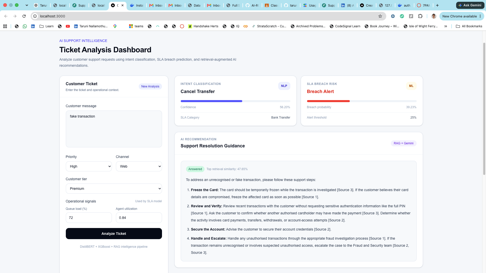
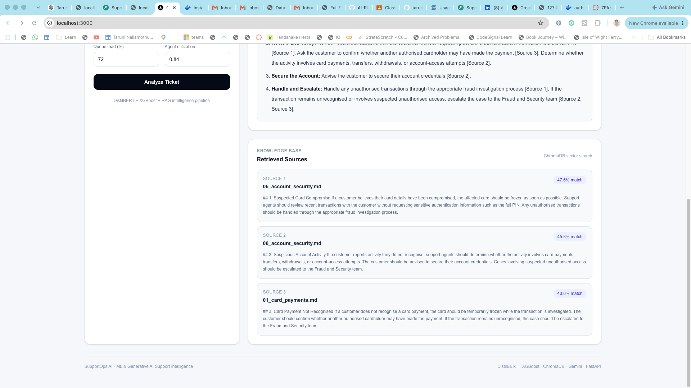
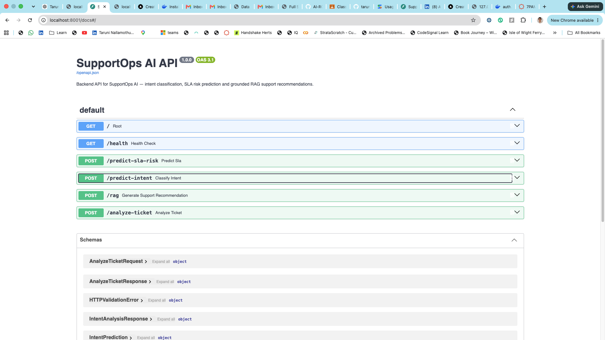
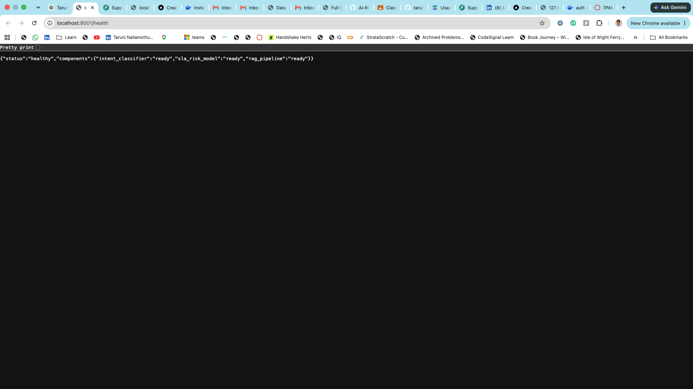
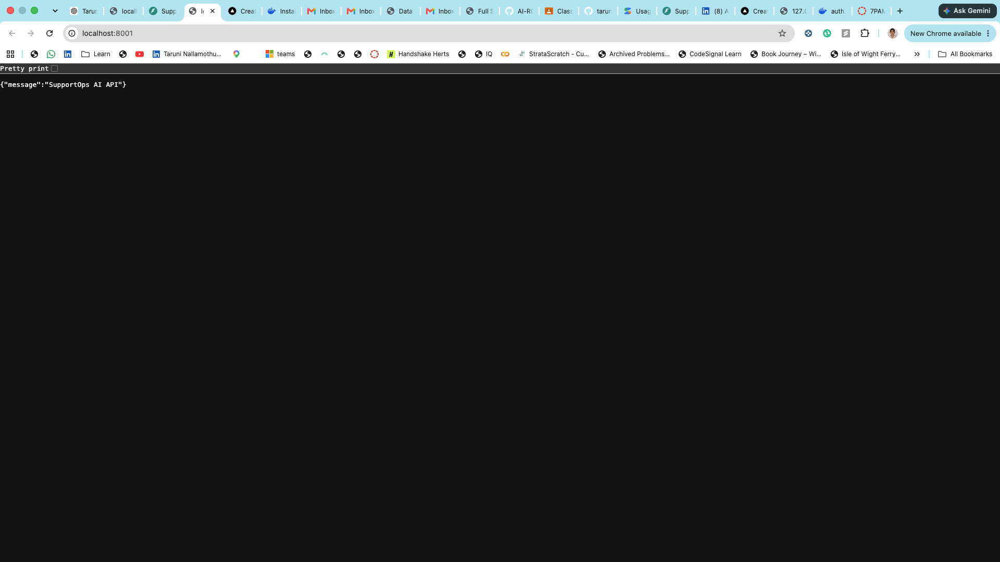

# SupportOps AI

AI-Powered Customer Support Intelligence & Resolution Platform.

SupportOps AI is an end-to-end Machine Learning and Generative AI project designed to automate customer support ticket analysis, predict operational risks, retrieve relevant knowledge, and generate grounded resolution recommendations.

## Capabilities

- Customer support ticket classification
- Sentiment analysis
- Ticket priority prediction
- SLA breach prediction
- Explainable AI
- Retrieval-Augmented Generation (RAG)
- LLM-powered resolution recommendations
- Interactive analytics dashboard
- Model monitoring
- REST API deployment
- MLOps and CI/CD

## Table of Contents

- Machine Learning Pipeline
- RAG System
- SLA Risk Prediction
- FastAPI Backend
- Full-Stack Architecture
- Docker Deployment
- Screenshots
- Running Locally
- Future Improvements

##  Technology Stack

- Python
- Scikit-learn
- PyTorch
- Hugging Face Transformers
- FastAPI
- PostgreSQL / pgvector
- MLflow
- Docker
- React / Next.js
- Azure

### Phase 1 — Dataset Exploration & Baseline NLP Classification

An initial customer-support dataset containing 8,469 tickets was evaluated
for automated ticket-type classification.

Data-quality analysis identified:

- 85 unique ticket texts associated with multiple target labels
- 205 rows affected by conflicting labels
- Exact duplicate ticket descriptions
- 29 exact ticket texts initially appearing across both training and test sets
- Highly templated ticket descriptions with weak alignment between text and target labels

After removing conflicting records and exact duplicates, the final modelling
dataset contained 8,240 unique ticket texts with zero exact train/test overlap.

### Baseline Model

A baseline NLP classifier was developed using:

- TF-IDF text vectorization
- Unigrams and bigrams
- Logistic Regression
- Stratified 80/20 train-test split

Results after data-quality corrections:

| Metric | Score |
|---|---:|
| Accuracy | 19.54% |
| Macro Precision | 19.63% |
| Macro Recall | 19.54% |
| Macro F1 | 19.53% |

With five approximately balanced target classes, random-chance accuracy is
approximately 20%. Error analysis showed that ticket subjects and descriptions
were weakly associated with the provided ticket-type labels.

For example, tickets with the subject "Refund request" were distributed across
all five target classes rather than predominantly belonging to the
"Refund request" class.

### Decision

The dataset will therefore not be used as the primary training source for the
SupportOps AI ticket-intent classifier.

It will instead be retained for operational analytics and dashboard development,
while a more consistently labelled intent-classification dataset will be used
for the NLP modelling component.

## BANKING77 Intent Classification

After identifying label-quality issues in the initial customer-support dataset,
BANKING77 was selected as the primary dataset for SupportOps AI intent
classification.

### Dataset

- 10,003 official training examples
- 3,080 official test examples
- 77 customer-support intents
- 7 normalized queries overlapped between the official training and test sets
- A strict evaluation set was created with zero normalized train/test overlap

### Baseline Model

The first BANKING77 baseline used:

- TF-IDF text vectorization
- Unigrams and bigrams
- Logistic Regression
- 77-class intent classification

Baseline performance:

| Evaluation | Accuracy | Macro F1 |
|---|---:|---:|
| Official Test | 85.88% | 85.81% |
| Strict Zero-Overlap Test | 85.84% | 85.76% |

The very small difference between the official and strict evaluations indicates
that the overlapping examples did not materially inflate model performance.

### Hyperparameter Tuning

The classical model was further optimized using:

- Stratified train/validation splitting
- 3-fold Stratified Cross-Validation
- GridSearchCV
- Macro F1 as the model-selection metric
- TF-IDF n-gram tuning
- Minimum document-frequency tuning
- Sublinear term-frequency tuning
- Logistic Regression regularization tuning

The best configuration identified during cross-validation was:

- `ngram_range = (1, 1)`
- `min_df = 1`
- `sublinear_tf = True`
- `C = 4.0`

Best cross-validation Macro F1: approximately **86.67%**.

> Final tuned-model validation and test results are recorded in the experiment
> notebook and will be compared against Transformer-based models in the next phase.
### Transformer Model — DistilBERT

A pretrained `distilbert-base-uncased` model was fine-tuned for the same
77-class BANKING77 intent-classification task.

Token-length analysis showed:

- Mean sequence length: ~16 tokens
- 95% of queries: ≤ 37 tokens
- 99% of queries: ≤ 53 tokens
- Maximum sequence length: 98 tokens

Based on this distribution, `max_length = 64` was selected to reduce unnecessary
padding while retaining virtually all query information.

#### DistilBERT Experiment 1 — 3 Epochs

| Evaluation | Accuracy | Macro F1 |
|---|---:|---:|
| Official Test | 81.59% | 79.75% |
| Strict Zero-Overlap Test | 81.61% | 79.75% |

Learning-curve analysis showed that validation performance was still improving
after epoch 3, indicating that the model was undertrained.

#### DistilBERT Experiment 2 — 5 Epochs

The same configuration was retained while increasing training from 3 to 5 epochs.

Best validation Macro F1: **90.00%**

| Evaluation | Accuracy | Macro F1 |
|---|---:|---:|
| Official Test | **90.62%** | **90.59%** |
| Strict Zero-Overlap Test | **90.60%** | **90.57%** |

### Model Comparison

| Model | Official Accuracy | Official Macro F1 | Strict Accuracy | Strict Macro F1 |
|---|---:|---:|---:|---:|
| TF-IDF + Logistic Regression | 85.88% | 85.81% | 85.84% | 85.76% |
| DistilBERT - 3 Epochs | 81.59% | 79.75% | 81.61% | 79.75% |
| DistilBERT - 5 Epochs | **90.62%** | **90.59%** | **90.60%** | **90.57%** |

The final 5-epoch DistilBERT model improved official Macro F1 by approximately
**4.78 percentage points** over the classical TF-IDF + Logistic Regression baseline.

The very small difference between official and strict zero-overlap evaluation
shows that the small number of duplicate queries in the official BANKING77 split
did not materially inflate performance.

## Retrieval-Augmented Generation (RAG)

SupportOps AI includes a grounded knowledge assistant for generating
policy-based customer-support recommendations.

The RAG pipeline uses:

- Sentence Transformers (`all-MiniLM-L6-v2`) for semantic embeddings
- 384-dimensional normalized text embeddings
- ChromaDB for persistent vector storage and cosine-similarity retrieval
- Top-K semantic retrieval over synthetic NovaBank support policies
- Gemini Flash-Lite for grounded response generation
- Explicit source citations for generated recommendations
- Retrieval-confidence guardrails for out-of-domain requests
- Safe fallback behavior when retrieved policies do not support an answer

### Knowledge Base

The demonstration knowledge base contains eight synthetic NovaBank policy
documents covering:

- Card payments
- Refunds
- Bank transfers
- Cash withdrawals
- Cards and PIN
- Account security
- Identity verification
- Support escalation

All policies are synthetic and were created solely for this portfolio project.

### RAG Evaluation

Retrieval was evaluated separately from generation to distinguish retrieval
failures from LLM-generation failures.

On the controlled synthetic evaluation set:

| Metric | Result |
|---|---:|
| Retrieval Hit@1 | 100% |
| Retrieval Hit@3 | 100% |
| Supported-query pass rate | 100% |
| Out-of-domain rejection rate | 100% |
| Citation compliance | 100% |
| Citation/refusal behavior | 100% |

These results reflect a controlled synthetic evaluation and should not be
interpreted as production-level performance.

### RAG Guardrails

SupportOps AI uses two levels of protection against unsupported responses:

1. A retrieval-confidence threshold prevents clearly unrelated questions from
   reaching the LLM.
2. Grounding instructions require the LLM to use only retrieved policy evidence
   and return an insufficient-context response when the available policies do
   not support an answer.

This design handles both completely out-of-domain questions and semantically
banking-related questions that are unsupported by the knowledge base.

## SLA Breach Risk Prediction

SupportOps AI includes an explainable SLA-risk model designed to identify
support tickets that may require proactive intervention.

### Data Quality Decision

The original customer-support dataset was evaluated for SLA modelling, but
49.30% of resolved tickets produced impossible negative response-to-resolution
durations.

Rather than constructing a misleading SLA target from unreliable timestamps,
the project uses a controlled synthetic NovaBank operational dataset with
explicit SLA rules and documented risk-generation assumptions.

### SLA Rules

| Priority | Resolution SLA |
|---|---:|
| Critical | 4 hours |
| High | 8 hours |
| Medium | 24 hours |
| Low | 48 hours |

### Models Evaluated

Two models were evaluated:

- Logistic Regression baseline
- XGBoost classifier

Model selection used the validation set with an operational requirement of at
least 70% recall for SLA breaches.

XGBoost was selected at a decision threshold of **0.25**, providing a better
precision/F1 trade-off while satisfying the recall requirement.

### Final Test Performance

| Metric | Result |
|---|---:|
| Precision | 40.23% |
| Recall | **77.98%** |
| F1 | 53.07% |
| ROC-AUC | 66.54% |
| PR-AUC | 49.65% |

The lower operational threshold intentionally prioritizes breach detection over
raw accuracy because missed SLA breaches are considered more costly than
additional review alerts.

### Explainability

SHAP was used to explain both global model behaviour and individual ticket
predictions.

The strongest global risk drivers included:

- Queue load
- Agent utilization
- Ticket creation timing
- Critical ticket priority
- Customer sentiment
- Previous customer contacts
- Outside-business-hours submission

The evaluation results reflect a controlled synthetic SLA-risk dataset and
should not be interpreted as production performance.

## FastAPI Backend

SupportOps AI exposes its ML and GenAI capabilities through a unified FastAPI backend.

### API Endpoints

| Endpoint | Purpose |
|---|---|
| `GET /health` | Check API and component readiness |
| `POST /predict-intent` | Predict one of 77 BANKING77 support intents using DistilBERT |
| `POST /predict-sla-risk` | Estimate SLA-breach probability using XGBoost |
| `POST /rag` | Generate grounded support recommendations using ChromaDB retrieval and Gemini |
| `POST /analyze-ticket` | Run intent classification, SLA-risk prediction, and RAG recommendation in one request |

### Unified Ticket Analysis

The `/analyze-ticket` endpoint combines the three AI components:

1. DistilBERT predicts the fine-grained support intent.
2. The intent is mapped into the broader operational category used by the SLA model.
3. XGBoost estimates SLA-breach risk using ticket and workload features.
4. The RAG pipeline retrieves relevant NovaBank policies.
5. Gemini generates a grounded recommendation with source citations.

### API Reliability

The backend includes:

- Pydantic request validation
- Explicit response schemas
- CORS configuration for frontend integration
- Graceful Gemini timeout handling
- Retrieval-confidence guardrails
- Health checks
- Automated FastAPI tests

On macOS, API serving uses CPU inference with `OMP_NUM_THREADS=1` to maintain stable interoperability between PyTorch and XGBoost.
# Full-Stack Application Architecture

SupportOps AI was extended into a complete full-stack AI application by integrating a Next.js frontend dashboard with the FastAPI AI backend.

The application provides an interactive interface for customer support analysts to analyze tickets, visualize machine learning predictions, and receive grounded AI-generated resolution recommendations.

The frontend communicates with the FastAPI backend through REST APIs and
provides a unified interface for:

- Ticket submission
- Intent prediction visualization
- SLA breach risk analysis
- AI-generated support recommendations
- Retrieved knowledge source display
- Confidence scores


## Final System Architecture
                Customer Support Agent
                          |
                          v

                   Next.js Dashboard
                 React + TypeScript

                          |
                          |
                     REST API

                          |
                          v

                    FastAPI Backend

          --------------------------------

          |              |               |

          v              v               v


    DistilBERT       XGBoost        RAG Pipeline

  Intent Model     SLA Prediction    ChromaDB

                                         |
                                         v

                                 Knowledge Base

                                         |
                                         v

                                  Gemini LLM

                                         |
                                         v

                            Grounded Recommendation


## Frontend Technology

- Next.js
- React
- TypeScript
- Tailwind CSS
- Docker containerized deployment
- REST API integration
## User Workflow

1. User submits a support ticket.
2. Frontend sends the request to `/analyze-ticket`.
3. FastAPI orchestrates all AI components.
4. DistilBERT predicts ticket intent.
5. XGBoost estimates SLA breach probability.
6. ChromaDB retrieves relevant knowledge base documents.
7. Gemini generates grounded support recommendations.
8. Frontend displays predictions, recommendations, and retrieved sources.


## Docker Deployment

SupportOps AI is fully containerized using Docker and Docker Compose to provide a reproducible development and deployment environment.

The application is composed of two containerized services:

## Backend Container

The backend container runs the FastAPI AI service and provides:

- REST API endpoints for ticket analysis
- DistilBERT-based intent classification inference
- XGBoost-based SLA breach risk prediction
- ChromaDB vector retrieval pipeline
- Gemini-powered grounded recommendation generation
- Health monitoring endpoints


## Frontend Container

The frontend container provides the user-facing dashboard built with:

- Next.js
- React
- TypeScript
- Tailwind CSS

Responsibilities include:

- Customer ticket submission
- Calling backend REST APIs
- Displaying intent predictions
- Visualizing SLA risk scores
- Presenting AI-generated recommendations
- Showing retrieved knowledge sources


## Application Screenshots

### Ticket Analysis Dashboard

The dashboard allows users to submit customer tickets and view:

- Intent classification
- SLA breach risk prediction
- AI-generated support recommendations
- Retrieved knowledge sources





### AI Recommendation and RAG Retrieval

The system retrieves relevant support documents from ChromaDB and generates grounded recommendations using Gemini.





### Backend API Documentation

FastAPI provides interactive Swagger documentation for testing endpoints.





### Health Monitoring

The backend exposes health checks for service readiness.




### FastAPI Root Endpoint

The backend service exposes a health-ready API running through FastAPI.



## API Quick Reference

| Endpoint | Description |
|---|---|
| GET /health | Service readiness check |
| POST /predict-intent | Intent classification |
| POST /predict-sla-risk | SLA risk prediction |
| POST /rag | Grounded recommendation generation |
| POST /analyze-ticket | Complete ticket analysis workflow |


## Running Locally

Prerequisites:

- Git
- Docker Desktop
- Docker Compose


### Clone Repository

```bash
git clone <repository-url>
cd supportops-ai
Start Application

Build and start all services:
docker compose up --build

---

# 4. Add service URLs

After docker compose command add:

```markdown
The application will be available at:

### Frontend Dashboard
http://localhost:3000

### Backend API
http://localhost:8001

#Application

## Future Improvements

Potential improvements include:

- Deploying the application to Azure Kubernetes Service (AKS)
- Adding authentication and role-based access control
- Implementing real-time ticket streaming
- Adding model monitoring with MLflow
- Integrating enterprise ticketing systems
- Expanding multilingual support